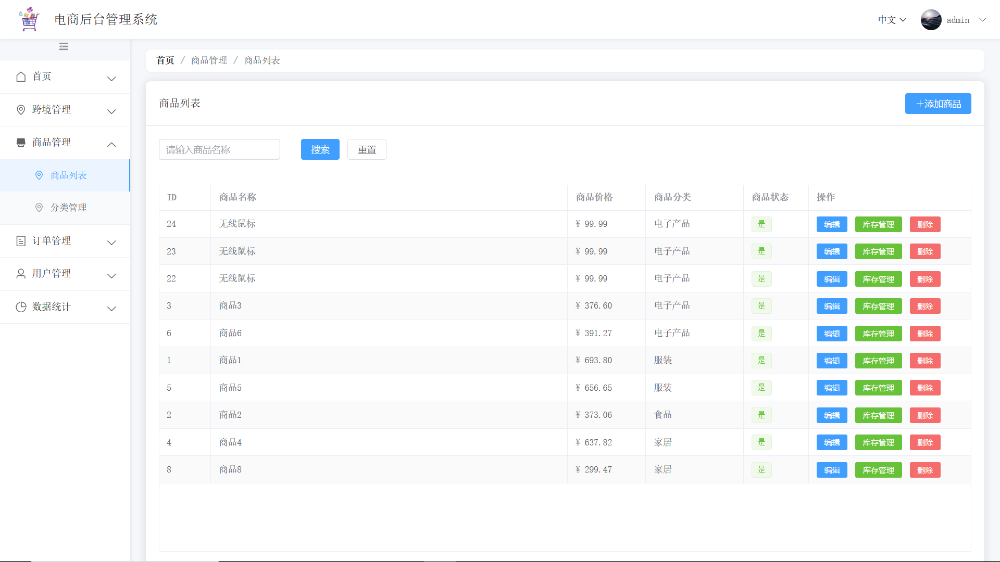

# Elemall (Cross-border E-commerce Admin System）

一个基于 Vue 3 + Element Plus 的跨境电商后台管理系统，支持多语言、多币种、跨境物流等功能。

(只是毕设，不再更新维护)

## 技术栈

- Vue 3
- Vue Router
- Element Plus
- Vue I18n
- Axios
- ECharts
- Mitt

## 主要功能

### 1. 用户管理
- 用户登录/登出
- 用户列表管理
- 角色权限控制

### 2. 商品管理
- 商品列表
- 商品分类
- 多语言商品信息
- 规格参数配置
- 库存管理

### 3. 订单管理
- 订单列表
- 订单详情
- 订单状态流转
- 物流跟踪

### 4. 跨境管理
- 多语言配置
- 汇率管理
- 仓库管理
- 清关管理

### 5. 数据统计
- 销售趋势
- 商品分析
- 订单分析
- 物流数据

## 项目结构

src/
├── assets/          # 静态资源
├── components/      # 公共组件
├── config/          # 配置文件
├── locales/         # 国际化语言包
├── plugins/         # 插件配置
├── router/          # 路由配置
├── utils/          # 工具函数
└── views/          # 页面组件
    ├── products/   # 商品相关
    ├── orders/     # 订单相关
    ├── warehouse/  # 仓库相关
    └── ...

## 开发环境要求

- Node.js >= 14.0.0
- npm >= 6.14.0

## 安装和运行

1. 安装依赖

```bash
npm install
```

2.开发环境运行

```bash
npm run serve
```

3. 生产环境构建
```bash
npm run build
```

## 主要功能截图

### 登录页面


### 系统首页


### 商品管理

#### 商品列表



#### 商品编辑


#### 商品库存


### 订单管理

#### 订单列表


#### 订单详情


#### 清关状态


### 数据统计

#### 销售统计


### 跨境管理

#### 语言管理


#### 汇率管理


#### 仓库管理


## 国际化支持

目前支持以下语言：
- 简体中文 (zh-CN)
- 英语 (en-US)
- 日语 (ja-JP)

## 数据库设计

系统包含以下主要数据表：
- Users (用户表)
- Products (商品表)
- Categories (分类表)
- Orders (订单表)
- Warehouses (仓库表)
- Inventories (库存表)
- Languages (语言表)
- ExchangeRates (汇率表)

详细的数据库设计请参考 `doc/model.md`

## API 文档

API 文档请参考 `doc/api.md`
后端详见我的另一个仓库[elemall-api](https://github.com/dukue/elemall-api)

## 贡献指南

1. Fork 本仓库
2. 创建新的功能分支 (`git checkout -b feature/AmazingFeature`)
3. 提交更改 (`git commit -m 'Add some AmazingFeature'`)
4. 推送到分支 (`git push origin feature/AmazingFeature`)
5. 创建 Pull Request

## 许可证

[MIT License](LICENSE)

## 联系方式

- 作者：dukue
- 邮箱：[2434918941a@gmail.com]

## 致谢

感谢以下开源项目：
- [Vue.js](https://vuejs.org/)
- [Element Plus](https://element-plus.org/)
- [ECharts](https://echarts.apache.org/)
```
